# Quadcopter Drone Project

A self-developed quadcopter flight control system based on STM32, supporting attitude stabilization, barometric altitude hold, wireless remote control, and more.

## Innovations

### 1. Three-Generation Hardware Iteration
Complete evolution from open-source firmware user to autonomous developer:
- **First Generation**: STM32H743 + APM open-source firmware, technology validation
- **Second Generation**: Optimized PCB design, successfully flashed APM firmware
- **Third Generation**: STM32F103 + self-developed flight controller, mastering core algorithms

### 2. Autonomous Flight Control Software
- Complete implementation of core algorithms including **quaternion attitude calculation**, **cascaded PID control**, and **sensor fusion**
- FreeRTOS-based multi-task real-time scheduling with millisecond-level task cycles
- Self-developed ANO_DT wireless communication protocol supporting multi-channel data transmission and online calibration

### 3. Low-Cost Solution
- Uses STM32F103C8T6 (CNY ¥15 / ~$2 USD) instead of H7 series (CNY ¥50+ / ~$7 USD), reducing MCU cost by 70%
- Simplified peripherals but complete functionality, suitable for learning and secondary development

---

## Project Evolution

This project has gone through three generations of hardware iteration, from using open-source firmware to fully autonomous flight control software development:

| Version | MCU | Firmware Solution | Status |
|------|-----|----------|------|
| First Version | STM32H743VIT6 | APM Open-Source Firmware | Completed |
| Second Version | STM32H743VIT6 | APM Open-Source Firmware | Completed |
| Third Version | STM32F103C8T6 | Self-Developed Flight Controller | In Progress |

### First & Second Versions (Open-Source Firmware Solution)

- MCU: STM32H743VIT6 (ARM Cortex-M7, 400MHz, 2MB Flash)
- Firmware: APM (ArduPilot) open-source flight controller firmware
- Status: PCB soldering completed, successfully flashed APM firmware and achieved flight controller connection
- Ground Station Interface: [APM Firmware Page](Demo/APM 固件页面.png)

### Third Version (Autonomous Development Solution)

- MCU: STM32F103C8T6 (ARM Cortex-M3, 72MHz, 64KB Flash)
- Firmware: Self-developed flight control software (based on FreeRTOS)
- Status: PCB ordered (not yet shipped due to Spring Festival holiday), components ready, firmware written and awaiting debugging
- Design Philosophy: Shift from using open-source firmware to autonomous development, aiming to deeply understand core algorithms of flight control systems, including attitude calculation, PID control, sensor fusion, and other key technologies

---

## Hardware Design Philosophy

### Power Distribution Board Evolution

**First Version Power Distribution Board**

- Design: Designed, soldered, and debugged by rzt; external power distribution board simultaneously powers ESCs and provides stepped-down voltage to flight controller board
- Issues:
  1. Size and mounting holes mismatch with frame
  2. ESCs have built-in BEC output, no need for additional voltage step-down for flight controller
- Physical Photo: 

**Second Version Power Distribution Board**

- Improvements:
  - Removed voltage step-down circuit, simplified design
  - 1 wired XT60 connector input, 4 horizontal XT60 connector outputs
  - Mounting holes match the frame
- Physical Photo: 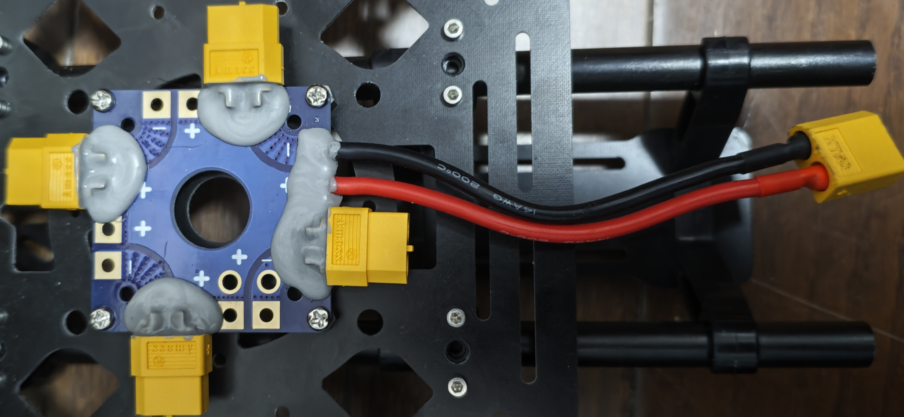

### Flight Controller Board Evolution

**First Version Flight Controller Board**

- Designer: hqg classmate
- Layers: 4-layer board
- Issues:
  1. Some interfaces and peripherals not routed out
  2. Size and mounting holes mismatch with frame

  | Physical Photo | 3D Preview |
  |------|------|
  |  | 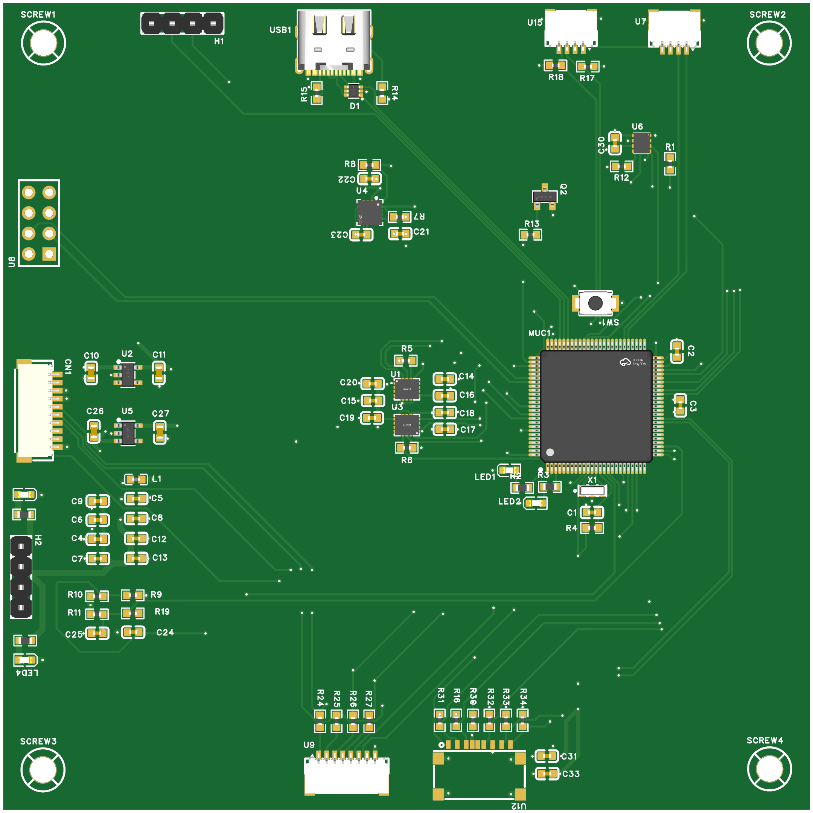 |

- Design Diagrams:

  | Front | Back |
  |------|------|
  |  | 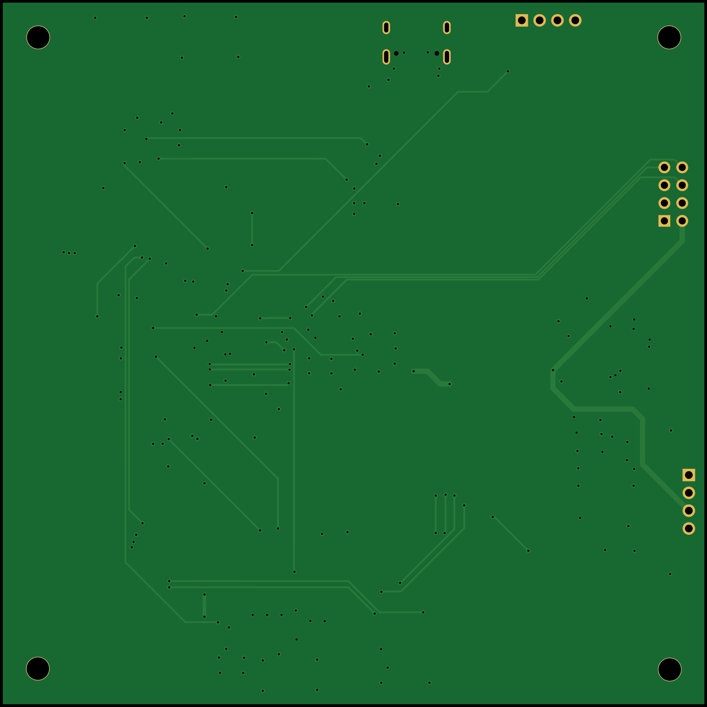 |


**Second Version Flight Controller Board**

- Designer: The author
- Status: Soldering successful, successfully flashed APM flight controller firmware
- Issues:
  1. Simply using open-source firmware doesn't teach core technologies
  2. Difficult to adapt custom remote controllers
  3. Mounting holes still have 1mm deviation from frame
- Physical Photos:
  | Physical Photo | 3D Preview |
  |------|------|
  | 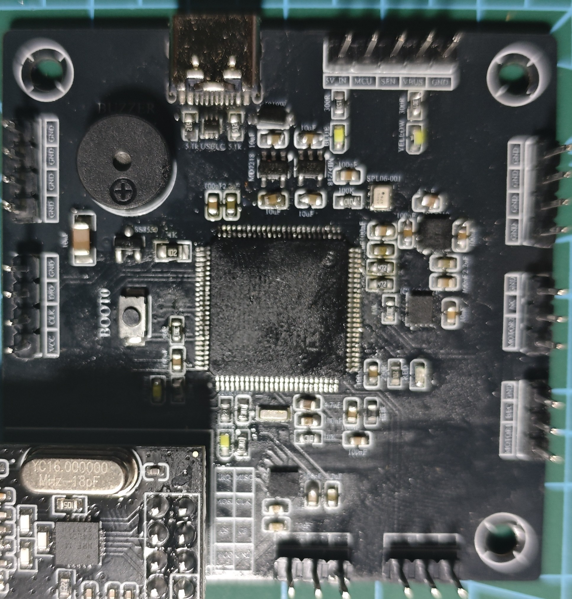 | 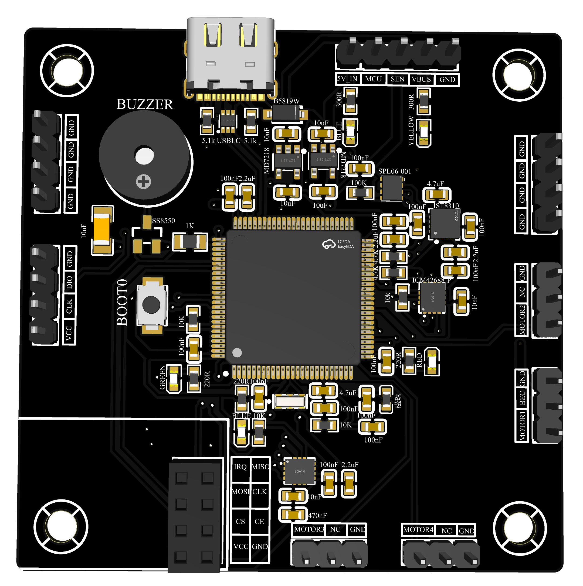 |
- Design Diagrams:

  | Front | Back |
  |------|------|
  |  | 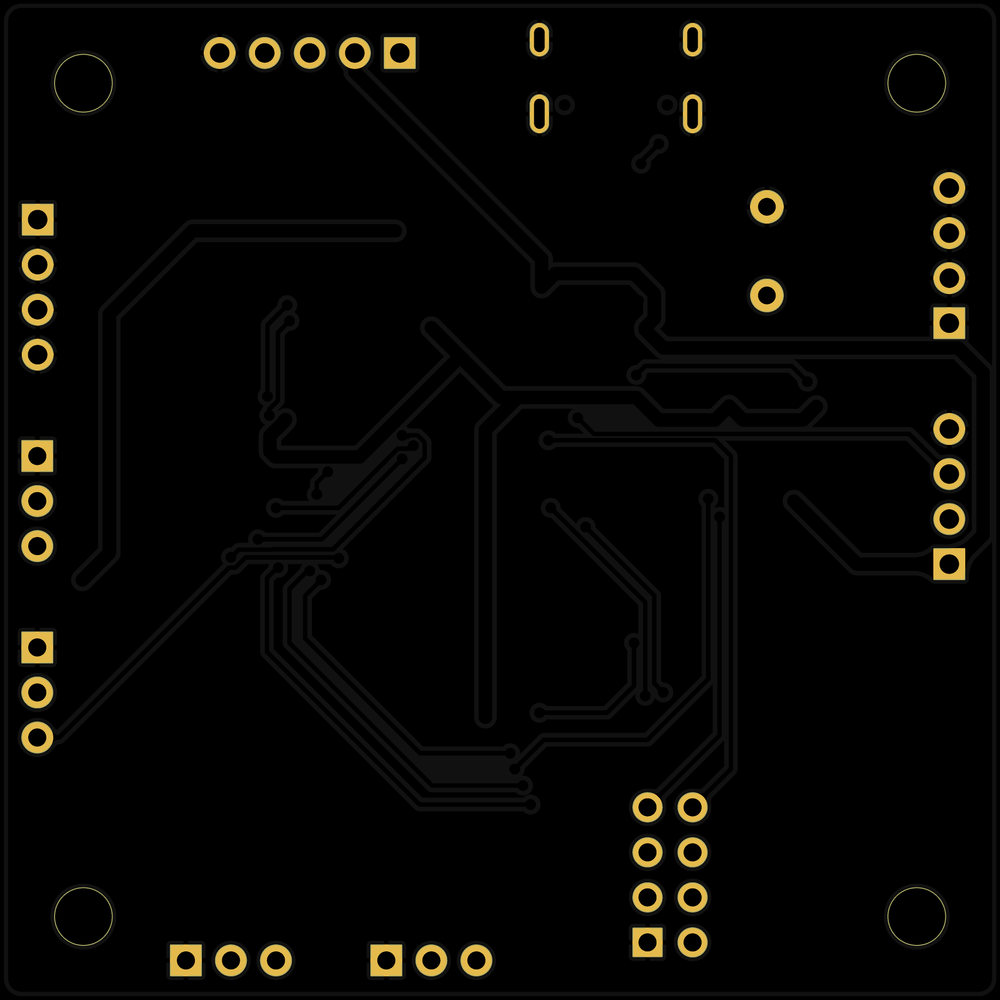 |


**Third Version Flight Controller Board**

- Designer: The author
- MCU: Changed to STM32F103C8T6, simplified peripherals
- Improvements: Mounting holes and size fully match the frame
- Status: PCB ordered (not yet shipped due to Spring Festival holiday), planned to solder, flash, and debug after returning to school
- Design Diagrams:

  | Front | Back |
  |------|------|
  | 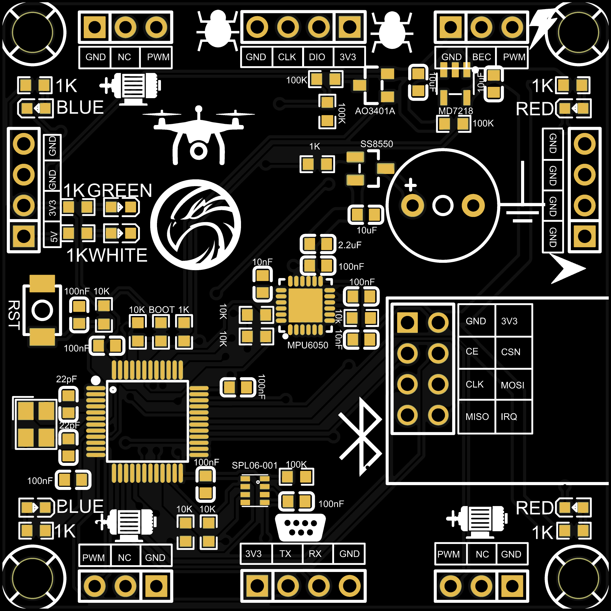 |  |

---

## Features

### Core Functions
- Attitude stabilization flight: MPU6050 6-axis sensor, quaternion attitude calculation
- Barometric altitude hold: SPL06-001 high-precision barometer, altitude measurement accuracy ±0.5m
- Wireless remote control: nRF24L01 2.4GHz wireless module, ANO_DT communication protocol
- LED status indication: Connection status, flight status visualization
- Buzzer alerts: Unlock, mode switch, failsafe audio feedback
- Motor control: 4-channel PWM output, supporting Hobbywing Skywalker 40A ESC

### Flight Modes
| Mode | Description | Entry Condition |
|------|------|----------|
| IDLE | Idle/Unarmed | Default state on power-up |
| NORMAL | Attitude stabilization mode | Enters after successful unlock |
| FIX_HEIGHT | Altitude hold mode | AUX1 < 1450 or AUX1 > 1550 |
| FAIL | Failsafe protection | Lost connection with remote controller |

### Unlock Procedure (Japanese Hand Mode 1)
1. Push throttle stick to maximum (≥1900) and hold for 1 second
2. Pull throttle stick to minimum (≤1100) and hold for 1 second
3. Unlock complete, motors idle rotation, buzzer long beep indication

---

## Remote Controller Calibration

### Throttle Calibration
1. Push throttle (right stick) to minimum
2. Long-press calibration button until light flashes
3. Repeat once

### Channel Mapping (Japanese Hand Mode 1)
| Channel | Stick/Button | Range | Description |
|------|-----------|------|------|
| THR (Throttle) | Right stick up/down | 1000-2000 | Controls aircraft altitude |
| YAW (Yaw) | Right stick left/right | 1000-2000 | Controls aircraft rotation |
| PIT (Pitch) | Left stick up/down | 1000-2000 | Controls aircraft forward/backward |
| ROL (Roll) | Left stick left/right | 1000-2000 | Controls aircraft left/right |

### Trim Button Description
| Button | Function | Description |
|------|------|------|
| Front Button | PIT +10 | Pitch channel increase 10 |
| Rear Button | PIT -10 | Pitch channel decrease 10 |
| Left Button | AUX1 +10 | Auxiliary channel 1 increase 10 |
| Right Button | AUX1 -10 | Auxiliary channel 1 decrease 10 |

---

## Software Architecture

### System Architecture

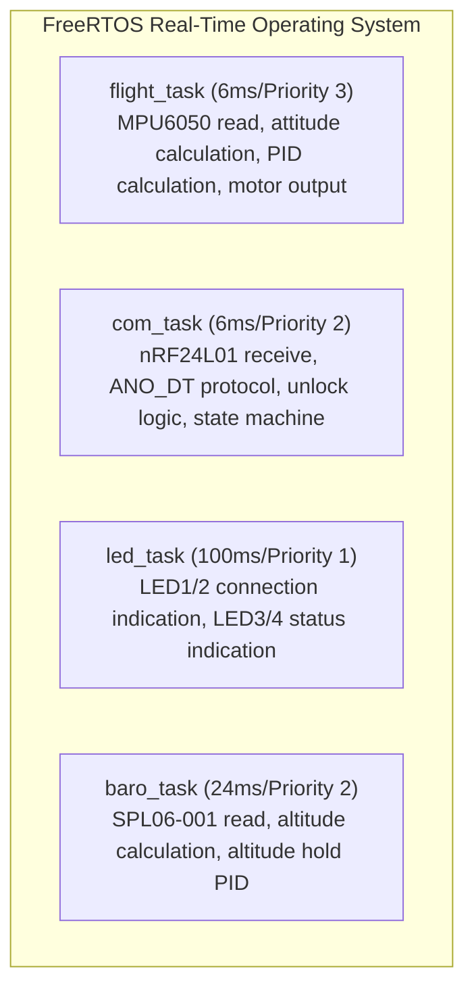

### Directory Structure

```
drone/
├── SoftWare/
│   ├── Flight_Control/       # Flight controller firmware (STM32F103)
│   │   ├── Application/      # Application layer (flight control, remote reception)
│   │   ├── common/           # Common algorithms (PID, filtering, attitude calculation)
│   │   ├── interface/        # Hardware driver layer (motors, sensors, LEDs)
│   │   ├── Core/             # HAL library
│   │   ├── FreeRTOS/         # Real-time operating system
│   │   └── doc/              # Technical documentation
│   ├── Remoter_Control/      # Remote controller firmware
│   ├── Test/                 # Test programs
│   └── OpenSource/           # Reference materials (APM/Pixhawk)
├── Hardware/
│   ├── V1/                   # First version schematics/PCB
│   ├── V2/                   # Current version
│   ├── V3/                   # Improved version
│   └── datasheet/            # Component datasheets
├── Demo/                     # Demo images and videos
├── Rack/                     # Frame related materials
└── Learning/                 # Learning materials
```

### Data Flow

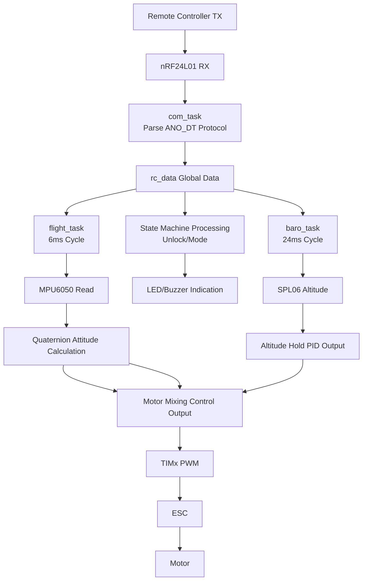

### Task Description

| Task | Cycle | Priority | Function |
|------|------|--------|------|
| flight_task | 6ms | 3 | MPU6050 read, attitude calculation, PID calculation, motor output |
| com_task | 6ms | 2 | nRF24L01 receive, ANO_DT protocol parsing, unlock logic, state machine |
| led_task | 100ms | 1 | LED1/2 connection indication, LED3/4 status indication |
| baro_task | 24ms | 2 | SPL06-001 read, altitude calculation, altitude hold PID |

### Software Modules

| Module | File | Function |
|------|------|------|
| Flight Control | Application/App_flight.c | Attitude calculation, PID control, motor mixing |
| Remote Reception | Application/App_receive_data.c | nRF24L01 driver, ANO_DT protocol, state machine |
| Task Scheduling | Application/App_freeRTOS_Task.c | FreeRTOS task creation and scheduling |
| PID Algorithm | common/Com_pid.c | Incremental PID controller |
| Filtering Algorithm | common/Com_filter.c | Low-pass filtering, Kalman filtering |
| Attitude Calculation | common/Com_imu.c | Quaternion attitude calculation |
| Motor Driver | interface/Int_motor.c | TIMx PWM output, ESC control |
| Sensor Driver | interface/Int_mpu6050.c, Int_spl06.c | I2C sensor driver |
| Wireless Driver | interface/Int_nRF24L01.c | SPI wireless module driver |
| Indicator Driver | interface/Int_led.c, Int_buzzer.c | LED, buzzer control |

---

## PID Parameters

### Cascaded PID Structure

The flight controller uses **cascaded PID** control, with outer loop controlling angle and inner loop controlling angular velocity:

```
Target Angle → [Angle PID] → Target Angular Velocity → [Angular Velocity PID] → Motor Output
```

### Current Parameter Configuration

| Control Loop | Parameter | kp | ki | kd | Description |
|--------|------|----|----|----|----|
| Pitch | pitch_pid | -7.00 | 0.00 | 0.00 | Outer Loop - Angle Control |
| | gyro_y_pid | 3.00 | 0.00 | 0.50 | Inner Loop - Angular Velocity Control |
| Roll | roll_pid | -7.00 | 0.00 | 0.00 | Outer Loop - Angle Control |
| | gyro_x_pid | 3.00 | 0.00 | 0.50 | Inner Loop - Angular Velocity Control |
| Yaw | yaw_pid | -3.00 | 0.00 | 0.00 | Outer Loop - Angle Control |
| | gyro_z_pid | -5.00 | 0.00 | 0.00 | Inner Loop - Angular Velocity Control |
| Altitude Hold | height_pid | -0.60 | 0.00 | -0.20 | Barometric Altitude Control |

### Parameter Tuning Recommendations

1. Tune inner loop (angular velocity loop) first:
   - Gradually increase `kd` until response is fast with no overshoot
   - Add small amount of `ki` if there is steady-state error

2. Then tune outer loop (angle loop):
   - Gradually increase `kp` until response is rapid
   - Generally doesn't need `ki` and `kd`

3. Altitude hold PID:
   - First tune `kp` for fast altitude tracking response
   - Add `kd` to suppress overshoot

> Note: Parameter signs are related to motor mixing control formula, pay attention to direction when modifying

---

## State Transitions

### State Transition Flowchart

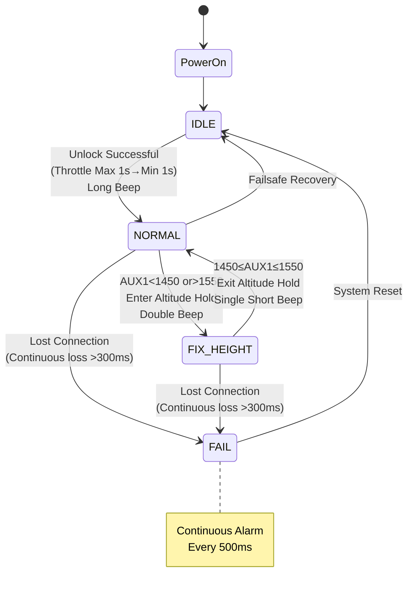

### State Transition Conditions

| Transition | Condition | Buzzer Feedback |
|------|------|------------|
| IDLE → NORMAL | Throttle max (≥1900) hold 1s → min (≤1100) hold 1s | Long beep (500ms) |
| NORMAL → FIX_HEIGHT | AUX1 < 1450 or AUX1 > 1550 | Double beep (2×100ms) |
| FIX_HEIGHT → NORMAL | 1450 ≤ AUX1 ≤ 1550 | Single short beep (100ms) |
| ANY → FAIL | Remote controller continuously lost connection >300ms | Continuous alarm (every 500ms) |
| FAIL → IDLE | System reset | None |

---

## Hardware Configuration

### Flight Controller Board
| Component | Model | Description |
|------|------|------|
| MCU | STM32F103C8T6 | ARM Cortex-M3, 72MHz, 64KB Flash |
| IMU | MPU6050 | 6-axis gyroscope + accelerometer, I2C1 interface |
| Barometer | SPL06-001 | High-precision barometer/temperature sensor, I2C2 interface |
| Wireless | nRF24L01 | 2.4GHz wireless transceiver, SPI1 interface |
| ESC | Hobbywing Skywalker 40A | Supports 2-6S LiPo battery, PWM signal control |

### Motor Layout (X-Type Quadcopter)

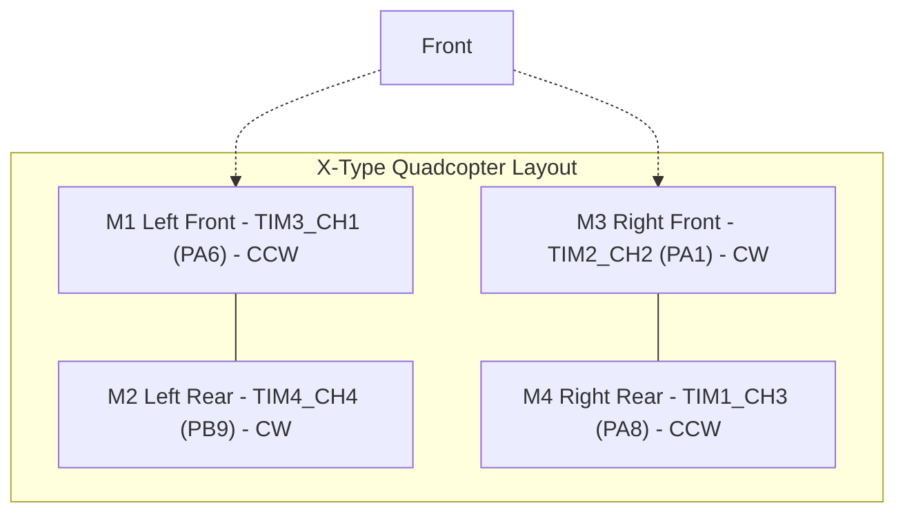

### Frame

LJI X500-X4 frame

### Power System
| Component | Model | Parameters |
|------|------|------|
| Motor | SunnySky 2212 Brushless Motor | 920KV, 1000W max power |
| ESC | Hobbywing Skywalker 30A | 2-6S LiPo, Continuous 30A |
| Propeller | 1147 Propeller | CW/CCW matched pair |
| Battery | 3S LiPo | 11.1V, 2200mAh, 25C |

---

## Physical Photo Gallery

### Complete Aircraft


### Startup Demo

[Startup Video](Demo/Startup_Video.mp4)

### Frame Gallery

| Frame Product Photo | Frame Physical Photo |
|-----------|-----------|
|  | 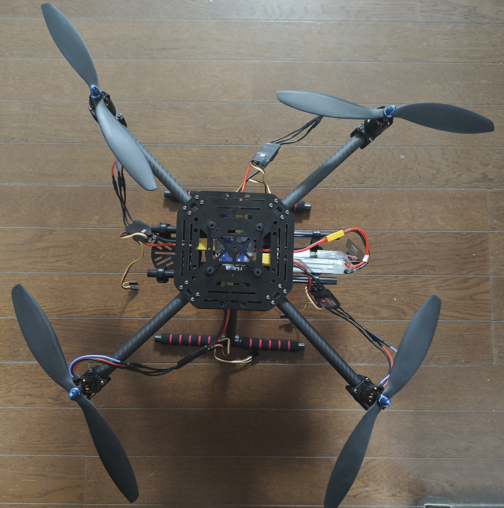 |

More frame photos in `Rack/Product/` and `Rack/Physical/` directories.

---

## Status Indication

### LED Layout

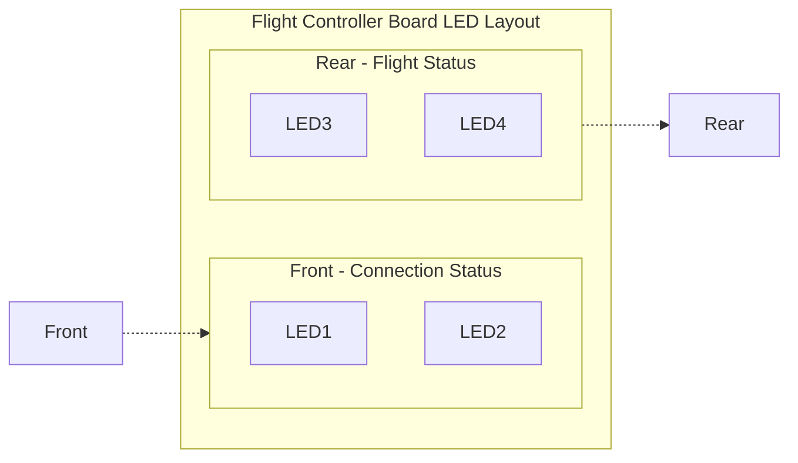

### Status Indicators

| Status | LED1/2 (Front) | LED3/4 (Rear) | Buzzer |
|------|-------------|-------------|--------|
| IDLE | Solid on when connected | Slow flash (500ms cycle) | Silent |
| NORMAL | Solid on | Fast flash (200ms cycle) | Long beep on unlock |
| FIX_HEIGHT | Solid on | Solid on | Entry/exit beep |
| FAIL | Off | Off | Continuous alarm |

Detailed status description see [System Status Description](SoftWare/Flight_Control/doc/系统状态说明.md)


## Quick Start

### First Power-On

1. Connect 3S LiPo battery, buzzer short beep indicates power-on
2. Observe LED status, wait for LED1/2 solid on (remote controller connection successful)
3. Execute unlock procedure (throttle max 1s → min 1s)
4. Long beep indicates unlock successful, motors idle rotation

### Debug Output

Debug information output via UART2 (PA2/PA3), baud rate 115200:

```
================================
Flight Control System Started
================================
MCU: STM32F103C8T6 @ 72MHz
FreeRTOS Heap: 3072 bytes
Sensors: MPU6050 (I2C1), SPL06 (I2C2)
================================
Flight: UNLOCKED
Flight: FIX_HEIGHT, alt=12 m
```

---

## Technical Documentation

| Document | Description |
|------|------|
| [Flight Controller README](SoftWare/Flight_Control/README.md) | Detailed flight controller firmware documentation |
| [System Status Description](SoftWare/Flight_Control/doc/system_status.md) | State transition logic and indication description |
| [ANO_DT Communication Protocol](SoftWare/Flight_Control/doc/nRF24L01_protocol.md) | Wireless communication protocol documentation |

## References

- [MPU6050 Datasheet](Hardware/datasheet/MPU6050.pdf)
- [SPL06-001 Datasheet](Hardware/datasheet/2101201914_Goertek-SPL06-001_C2684428.txt)
- [nRF24L01 Datasheet](Hardware/datasheet/nRF24L01.pdf)
- [STM32F103 Datasheet](Hardware/datasheet/STM32F103C8T6.pdf)
- [FreeRTOS Official Documentation](https://www.freertos.org/)
