# 四旋翼无人机项目

基于 STM32 的自主开发四旋翼无人机飞行控制系统，支持姿态自稳、气压计定高、无线遥控等功能。

## 创新点

### 1. 三代硬件迭代演进
从开源固件使用者到自主开发者的完整演进路线：
- **第一代**：STM32H743 + APM 开源固件，技术验证
- **第二代**：优化 PCB 设计，成功烧录 APM 固件
- **第三代**：STM32F103 + 自研飞控，掌握核心算法

### 2. 自主飞控软件
- 完整实现**四元数姿态解算**、**串级 PID 控制**、**传感器融合**等核心算法
- 基于 FreeRTOS 的多任务实时调度，任务周期精确到毫秒级
- 自研 ANO_DT 无线通讯协议，支持多通道数据传输和在线校准

### 3. 低成本方案
- 选用 STM32F103C8T6（￥15 级）替代 H7 系列（￥50+），降低 70% MCU 成本
- 外设精简但功能完整，适合学习和二次开发

---

## 项目演进

本项目共经历了三代硬件迭代，从使用开源固件到完全自主开发飞控软件：

| 版本 | MCU | 固件方案 | 状态 |
|------|-----|----------|------|
| 第一版 | STM32H743VIT6 | APM 开源固件 | 已完成 |
| 第二版 | STM32H743VIT6 | APM 开源固件 | 已完成 |
| 第三版 | STM32F103C8T6 | 自主开发飞控 | 进行中 |

### 第一版 & 第二版 (开源固件方案)

- MCU: STM32H743VIT6 (ARM Cortex-M7, 400MHz, 2MB Flash)
- 固件：APM (ArduPilot) 开源飞控固件
- 状态：已完成打板焊接，成功烧录 APM 固件并实现飞控链接
- 地面站界面：[APM 固件页面](Demo/APM 固件页面.png)

### 第三版 (自主开发方案)

- MCU: STM32F103C8T6 (ARM Cortex-M3, 72MHz, 64KB Flash)
- 固件：自主开发飞控软件 (基于 FreeRTOS)
- 状态：PCB 已下单 (因春节假期尚未发货)，元器件已备齐，固件已编写完成待调试
- 设计思路：从使用开源固件转向自主开发，旨在深入理解飞控系统的核心算法，包括姿态解算、PID 控制、传感器融合等关键技术

---

## 硬件设计思路

### 分电板演进

**第一版分电板**

- 设计：rzt设计焊接和调试的，外部分电板同时给电调供电和经降压给飞控板供电
- 问题：
  1. 尺寸和孔位与机架不匹配
  2. 电调自带 BEC 输出，无需额外降压给飞控供电
- 实物图：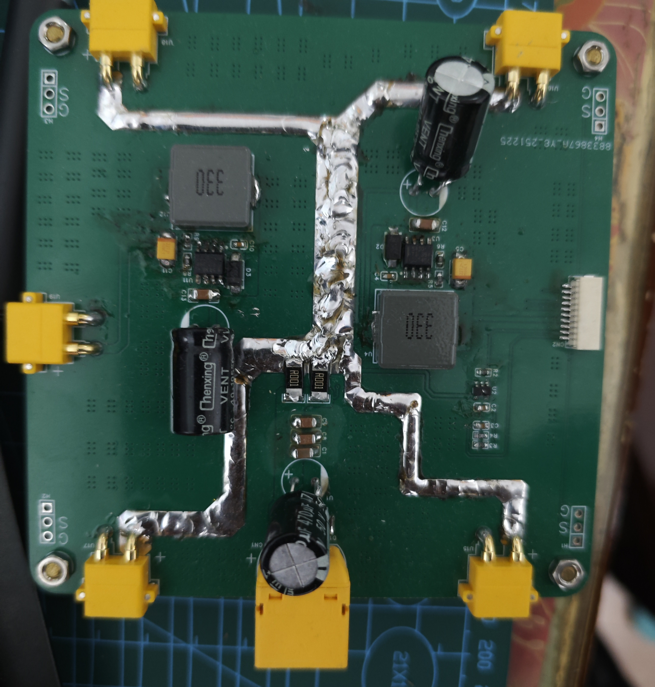

**第二版分电板**

- 改进：
  - 移除降压电路，简化设计
  - 1 个带线 XT60 接口输入，4 个卧式 XT60 接口输出
  - 孔位与机架匹配
- 实物图：

### 飞控板演进

**第一版飞控板**

- 设计者：hqg 同学

- 板层：四层板

- 问题：
  1. 部分接口和外设没有引出
  2. 尺寸和孔位与机架不匹配
  
  | 实物图 | 3D预览 |
  |------|------|
  | 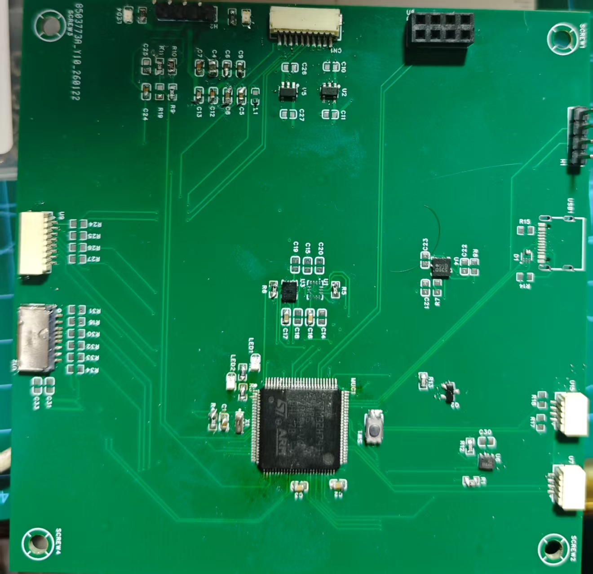 | 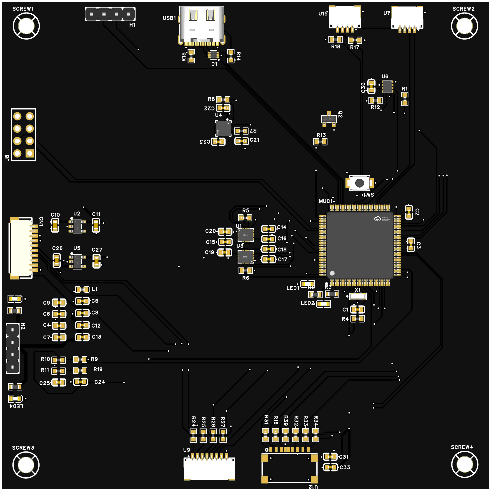 |
  
- 设计图：

  | 正面 | 背面 |
  |------|------|
  | 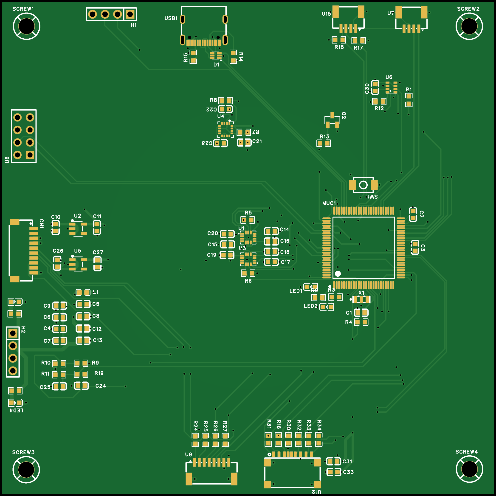 |  |


**第二版飞控板**

- 设计者：本人
- 状态：焊接成功，成功烧录 APM 飞控固件
- 问题：
  1. 单纯使用开源固件学不到核心技术
  2. 难以适配自定义遥控器
  3. 孔位与机架仍有 1mm 偏差
- 实物图：
  | 实物图 | 3D预览 |
  |------|------|
  | 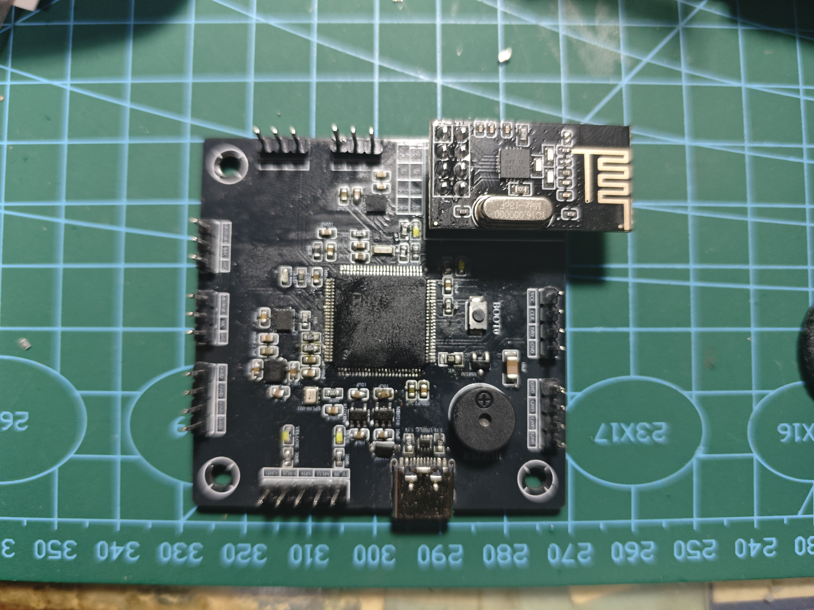 |  |
- 设计图：

  | 正面 | 背面 |
  |------|------|
  | 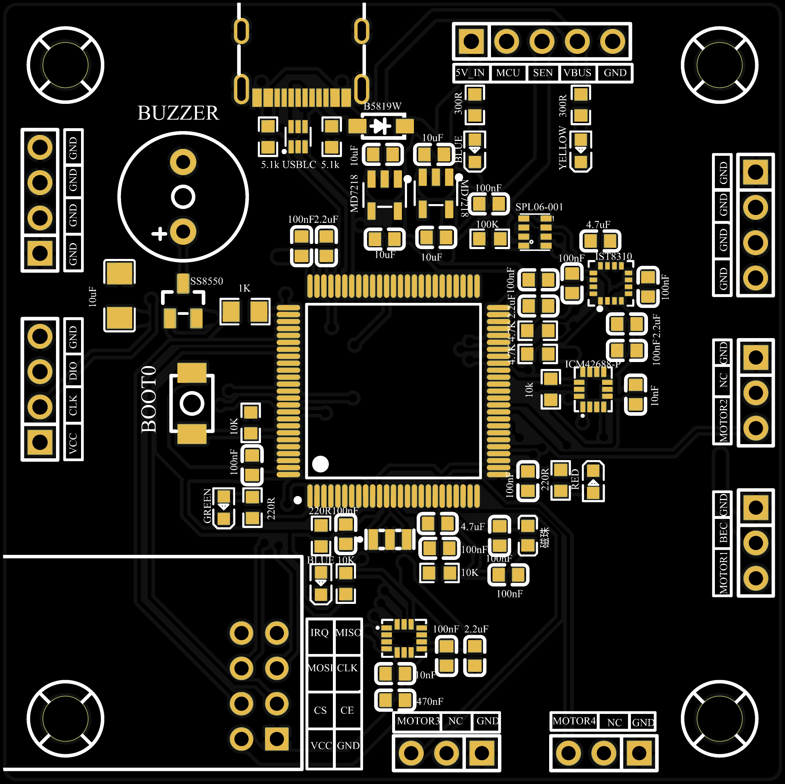 |  |


**第三版飞控板**

- 设计者：本人
- MCU：改用 STM32F103C8T6，简化外设
- 改进：孔位和尺寸与机架完全适配
- 状态：PCB 已下单 (因春节假期尚未发货)，计划开学回校后焊接、烧录、调试
- 设计图：

  | 正面 | 背面 |
  |------|------|
  |  | 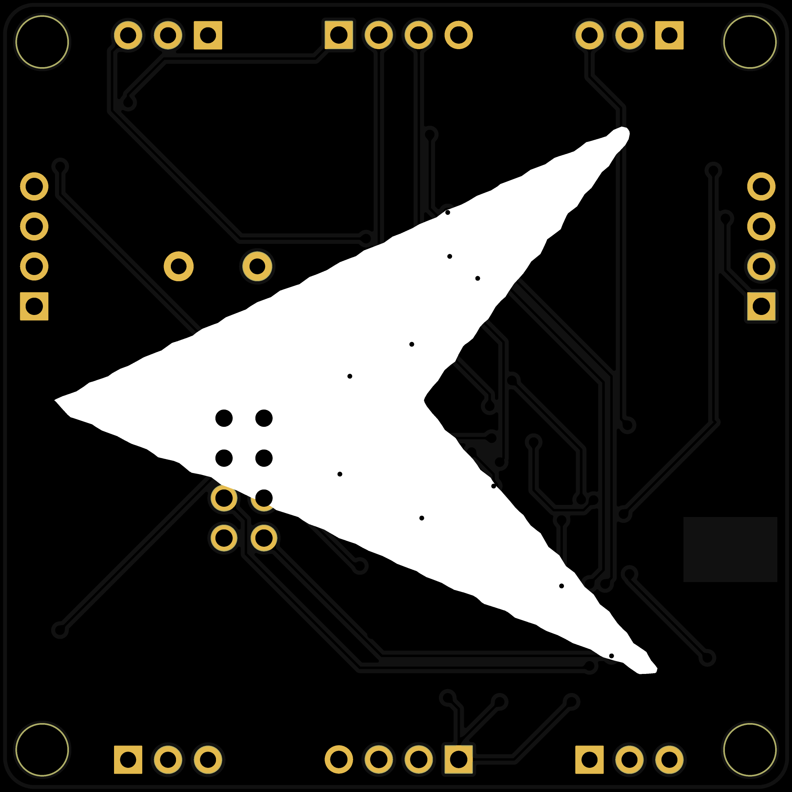 |

---

## 功能描述

### 核心功能
- 姿态自稳飞行：MPU6050 六轴传感器，四元数姿态解算
- 气压计定高：SPL06-001 高精度气压计，高度测量精度 ±0.5m
- 无线遥控：nRF24L01 2.4GHz 无线模块，ANO_DT 通讯协议
- LED 状态指示：连接状态、飞行状态可视化
- 蜂鸣器提示：解锁、模式切换、失控报警音频反馈
- 电机控制：4 路 PWM 输出，支持好盈天行者 40A 电调

### 飞行模式
| 模式 | 说明 | 进入条件 |
|------|------|----------|
| IDLE | 怠速/未解锁 | 上电默认状态 |
| NORMAL | 姿态自稳模式 | 解锁成功后进入 |
| FIX_HEIGHT | 定高模式 | AUX1 < 1450 或 AUX1 > 1550 |
| FAIL | 失控保护 | 遥控器失联 |

### 解锁流程 (日本手 Mode 1)
1. 油门摇杆推到最大 (≥1900) 保持 1 秒
2. 油门摇杆拉到最小 (≤1100) 保持 1 秒
3. 解锁完成，电机怠速旋转，蜂鸣器长鸣提示

---

## 遥控器校准

### 油门校准
1. 油门 (右摇杆) 推到最下
2. 长按校准按键直到灯光闪烁
3. 重复一次

### 通道映射 (日本手 Mode 1)
| 通道 | 摇杆/按键 | 范围 | 说明 |
|------|-----------|------|------|
| THR (油门) | 右摇杆上下 | 1000-2000 | 控制飞行器高度 |
| YAW (偏航) | 右摇杆左右 | 1000-2000 | 控制飞行器旋转 |
| PIT (俯仰) | 左摇杆上下 | 1000-2000 | 控制飞行器前后 |
| ROL (横滚) | 左摇杆左右 | 1000-2000 | 控制飞行器左右 |

### 微调按键说明
| 按键 | 功能 | 说明 |
|------|------|------|
| 前按键 | PIT +10 | 俯仰通道增加 10 |
| 后按键 | PIT -10 | 俯仰通道减少 10 |
| 左按键 | AUX1 +10 | 辅助通道 1 增加 10 |
| 右按键 | AUX1 -10 | 辅助通道 1 减少 10 |

---

## 软件架构

### 系统架构

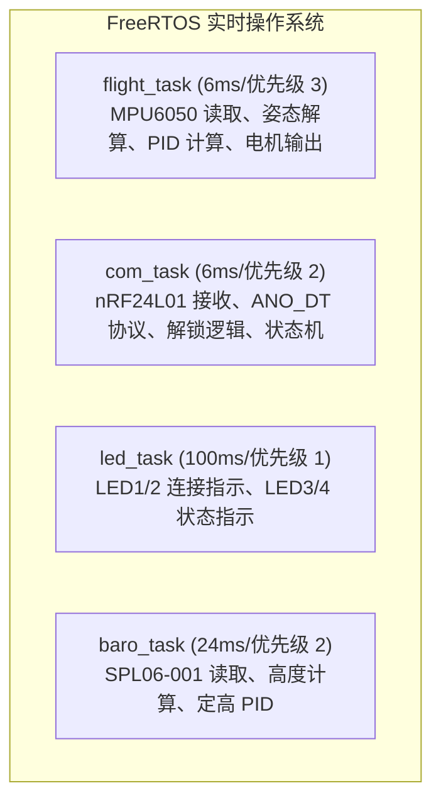

### 目录结构

```
drone/
├── SoftWare/
│   ├── Flight_Control/       # 飞控固件 (STM32F103)
│   │   ├── Application/      # 应用层 (飞行控制、遥控接收)
│   │   ├── common/           # 通用算法 (PID、滤波、姿态解算)
│   │   ├── interface/        # 硬件驱动层 (电机、传感器、LED)
│   │   ├── Core/             # HAL 库
│   │   ├── FreeRTOS/         # 实时操作系统
│   │   └── doc/              # 技术文档
│   ├── Remoter_Control/      # 遥控器固件
│   ├── Test/                 # 测试程序
│   └── 开源飞控/             # 参考资料 (APM/Pixhawk)
├── Hardware/
│   ├── 第一版/               # 初版原理图/PCB
│   ├── 第二版/               # 当前版本
│   ├── 第三版/               # 改进版本
│   └── datasheet/            # 元器件数据手册
├── Demo/                     # 演示图片与视频
├── 机架/                     # 机架相关资料
└── Learning/                 # 学习资料
```

### 数据流

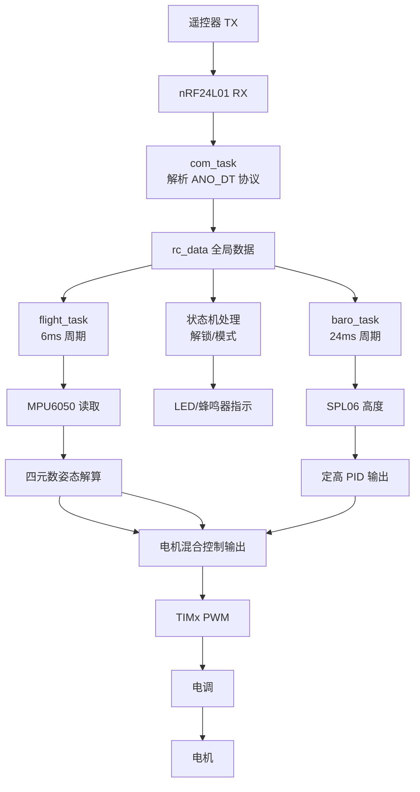

### 任务说明

| 任务 | 周期 | 优先级 | 功能 |
|------|------|--------|------|
| flight_task | 6ms | 3 | MPU6050 读取、姿态解算、PID 计算、电机输出 |
| com_task | 6ms | 2 | nRF24L01 接收、ANO_DT 协议解析、解锁逻辑、状态机 |
| led_task | 100ms | 1 | LED1/2 连接指示、LED3/4 状态指示 |
| baro_task | 24ms | 2 | SPL06-001 读取、高度计算、定高 PID |

### 软件模块

| 模块 | 文件 | 功能 |
|------|------|------|
| 飞行控制 | Application/App_flight.c | 姿态解算、PID 控制、电机混合 |
| 遥控接收 | Application/App_receive_data.c | nRF24L01 驱动、ANO_DT 协议、状态机 |
| 任务调度 | Application/App_freeRTOS_Task.c | FreeRTOS 任务创建与调度 |
| PID 算法 | common/Com_pid.c | 增量式 PID 控制器 |
| 滤波算法 | common/Com_filter.c | 低通滤波、卡尔曼滤波 |
| 姿态解算 | common/Com_imu.c | 四元数姿态解算 |
| 电机驱动 | interface/Int_motor.c | TIMx PWM 输出、电调控制 |
| 传感器驱动 | interface/Int_mpu6050.c, Int_spl06.c | I2C 传感器驱动 |
| 无线驱动 | interface/Int_nRF24L01.c | SPI 无线模块驱动 |
| 指示驱动 | interface/Int_led.c, Int_buzzer.c | LED、蜂鸣器控制 |

---

## PID 参数

### 串级 PID 结构

飞控采用**串级 PID**控制，外环控制角度，内环控制角速度：

```
期望角度 → [角度 PID] → 期望角速度 → [角速度 PID] → 电机输出
```

### 当前参数配置

| 控制环 | 参数 | kp | ki | kd | 说明 |
|--------|------|----|----|----|----|
| 俯仰角 | pitch_pid | -7.00 | 0.00 | 0.00 | 外环 - 角度控制 |
| | gyro_y_pid | 3.00 | 0.00 | 0.50 | 内环 - 角速度控制 |
| 横滚角 | roll_pid | -7.00 | 0.00 | 0.00 | 外环 - 角度控制 |
| | gyro_x_pid | 3.00 | 0.00 | 0.50 | 内环 - 角速度控制 |
| 偏航角 | yaw_pid | -3.00 | 0.00 | 0.00 | 外环 - 角度控制 |
| | gyro_z_pid | -5.00 | 0.00 | 0.00 | 内环 - 角速度控制 |
| 定高 | height_pid | -0.60 | 0.00 | -0.20 | 气压计高度控制 |

### 参数调谐建议

1. 先调内环（角速度环）：
   - 逐步增大 `kd` 直到响应快速且无超调
   - 如有静差可加入少量 `ki`

2. 再调外环（角度环）：
   - 逐步增大 `kp` 直到响应迅速
   - 一般不需要 `ki` 和 `kd`

3. 定高 PID：
   - 先调 `kp` 使高度跟踪响应快速
   - 加入 `kd` 抑制超调

> 注意：参数符号与电机混合控制公式相关，修改时需注意方向

---

## 状态切换

### 状态切换流程图

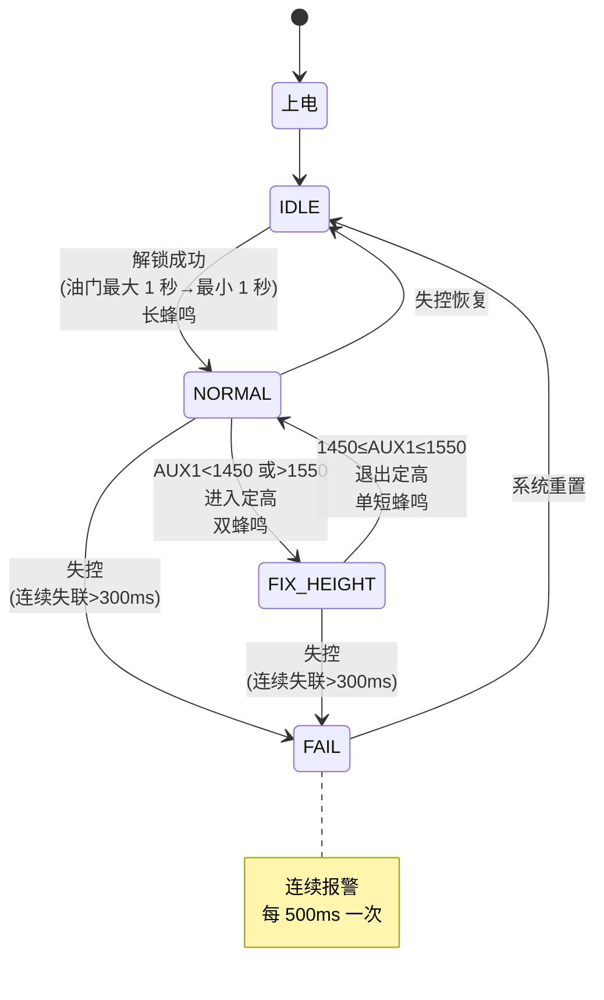

### 状态切换条件

| 切换 | 条件 | 蜂鸣器反馈 |
|------|------|------------|
| IDLE → NORMAL | 油门最大 (≥1900) 保持 1 秒 → 最小 (≤1100) 保持 1 秒 | 长蜂鸣 (500ms) |
| NORMAL → FIX_HEIGHT | AUX1 < 1450 或 AUX1 > 1550 | 双蜂鸣 (2×100ms) |
| FIX_HEIGHT → NORMAL | 1450 ≤ AUX1 ≤ 1550 | 单短蜂鸣 (100ms) |
| ANY → FAIL | 遥控器连续失联超过 300ms | 连续报警 (每 500ms 一次) |
| FAIL → IDLE | 系统重置 | 无 |

---

## 硬件配置

### 飞控板
| 组件 | 型号 | 说明 |
|------|------|------|
| MCU | STM32F103C8T6 | ARM Cortex-M3, 72MHz, 64KB Flash |
| IMU | MPU6050 | 6 轴陀螺仪 + 加速度计，I2C1 接口 |
| 气压计 | SPL06-001 | 高精度气压/温度传感器，I2C2 接口 |
| 无线 | nRF24L01 | 2.4GHz 无线收发，SPI1 接口 |
| 电调 | 好盈天行者 40A | 支持 2-6S 锂电池，PWM 信号控制 |

### 电机布局 (X 型四旋翼)

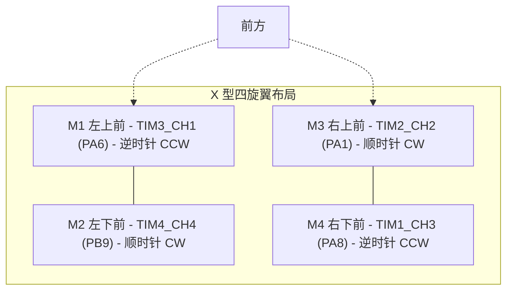

### 机架

LJI X500-X4机架

### 动力系统
| 组件 | 型号 | 参数 |
|------|------|------|
| 电机 | 朗宇2212 无刷电机 | 920KV, 1000W 最大功率 |
| 电调 | 好盈天行者 30A | 2-6S LiPo, 持续 30A |
| 螺旋桨 | 1147 桨 | 正反桨配对 |
| 电池 | 3S LiPo | 11.1V, 2200mAh, 25C |

---

## 实物图展示

### 整机实物


### 启动演示

[启动录像](Demo/启动录像.mp4)

### 机架展示

| 机架商品图 | 机架实物图 |
|-----------|-----------|
| 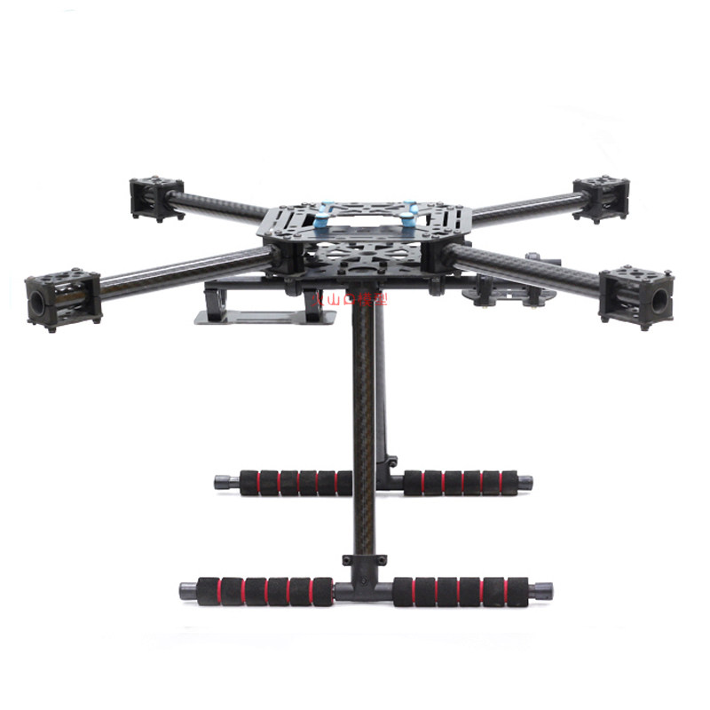 |  |

更多机架图片见 `机架/商品图/` 和 `机架/实物图/` 目录。

---

## 状态指示

### LED 布局

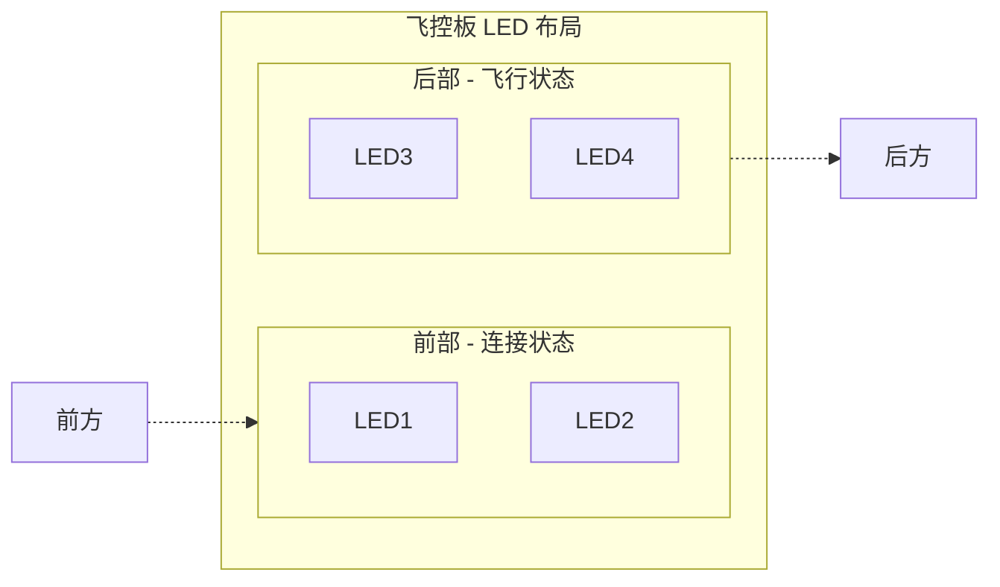

### 状态表现

| 状态 | LED1/2 (前) | LED3/4 (后) | 蜂鸣器 |
|------|-------------|-------------|--------|
| IDLE | 连接时常亮 | 慢闪 (500ms 周期) | 无声 |
| NORMAL | 常亮 | 快闪 (200ms 周期) | 解锁时长鸣 |
| FIX_HEIGHT | 常亮 | 常亮 | 进出时提示音 |
| FAIL | 熄灭 | 熄灭 | 连续报警 |

详细状态说明见 [系统状态说明](SoftWare/Flight_Control/doc/系统状态说明.md)


## 快速开始

### 首次上电

1. 连接 3S 锂电池，蜂鸣器短鸣提示上电
2. 观察 LED 状态，等待 LED1/2 常亮 (遥控器连接成功)
3. 执行解锁流程 (油门最大 1 秒 → 最小 1 秒)
4. 蜂鸣器长鸣表示解锁成功，电机怠速旋转

### 调试输出

通过 UART2 (PA2/PA3) 输出调试信息，波特率 115200：

```
================================
Flight Control System Started
================================
MCU: STM32F103C8T6 @ 72MHz
FreeRTOS Heap: 3072 bytes
Sensors: MPU6050 (I2C1), SPL06 (I2C2)
================================
Flight: UNLOCKED
Flight: FIX_HEIGHT, alt=12 m
```

---

## 技术文档

| 文档 | 说明 |
|------|------|
| [飞控系统 README](SoftWare/Flight_Control/README.md) | 飞控固件详细说明 |
| [系统状态说明](SoftWare/Flight_Control/doc/系统状态说明.md) | 状态切换逻辑和指示说明 |
| [ANO_DT 通讯协议](SoftWare/Flight_Control/doc/nRF24L01_通讯协议.md) | 无线通讯协议文档 |

## 参考资料

- [MPU6050 数据手册](Hardware/datasheet/MPU6050.pdf)
- [SPL06-001 数据手册](Hardware/datasheet/2101201914_Goertek-SPL06-001_C2684428.txt)
- [nRF24L01 数据手册](Hardware/datasheet/nRF24L01.pdf)
- [STM32F103 数据手册](Hardware/datasheet/STM32F103C8T6.pdf)
- [FreeRTOS 官方文档](https://www.freertos.org/)

