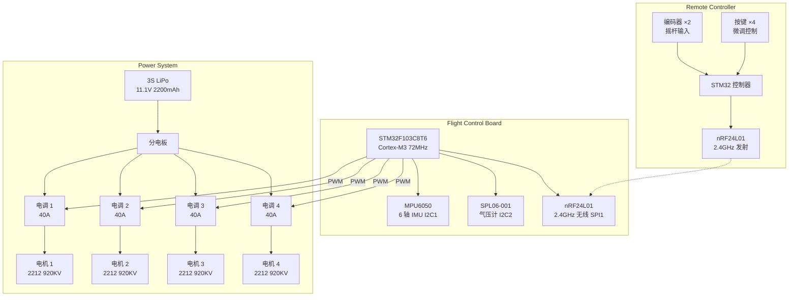
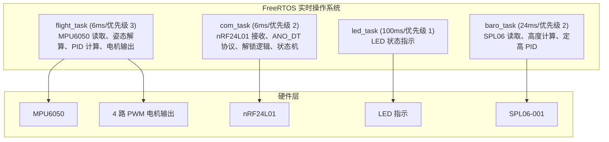
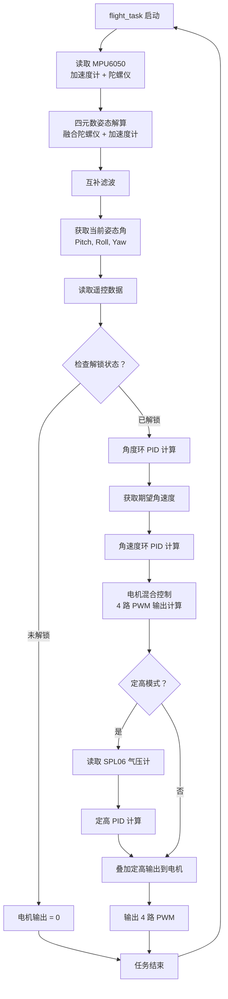
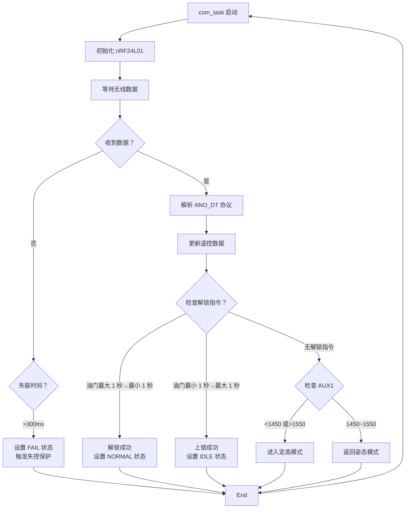

# 四旋翼无人机飞行控制系统 - 技术文档

## 一、项目概述

**项目名称**：基于 STM32 的四旋翼无人机飞行控制系统

**应用场景**：飞行控制算法研究、嵌入式系统学习、无人机技术验证

**功能描述**：基于 STM32F103C8T6 的自主开发四旋翼无人机飞行控制系统，采用 FreeRTOS 实时操作系统，通过 MPU6050 六轴传感器进行姿态测量，使用四元数法和串级 PID 算法实现飞行控制。支持姿态自稳、气压计定高、2.4GHz 无线遥控、状态反馈和失控保护等功能。

**核心功能模块**：
1. **姿态自稳**：MPU6050 六轴传感器 + 四元数姿态解算 + 互补滤波
2. **气压定高**：SPL06-001 高精度气压计，高度测量精度 ±0.5m
3. **无线遥控**：nRF24L01 2.4GHz 无线模块，ANO_DT 通讯协议
4. **状态反馈**：LED 状态指示 + 蜂鸣器音频反馈
5. **失控保护**：遥控器失联时自动停转并报警

**飞行模式**：
| 模式 | 说明 | 进入条件 |
|------|------|----------|
| IDLE | 怠速/未解锁 | 上电默认状态 |
| NORMAL | 姿态自稳模式 | 解锁成功后进入 |
| FIX_HEIGHT | 定高模式 | AUX1 < 1450 或 AUX1 > 1550 |
| FAIL | 失控保护 | 遥控器失联超过 300ms |

---

## 二、系统连接示意图



**飞控板硬件迭代**：
| 版本 | 设计者 | 板层 | 状态 | 备注 |
|------|--------|------|------|------|
| 第一版 | 黄千格 | 四层 | 已完成 | 接口未完全引出，孔位与机架不匹配 |
| 第二版 | 苗翔宇 | 四层 | 已完成 | 焊接成功，成功烧录 APM 固件 |
| 第三版 | 苗翔宇 | 四层 | 进行中 | 孔位与机架完全适配，MCU 改用 F103 |

**分电板硬件迭代**：
| 版本 | 设计者 | 状态 | 改进点 |
|------|--------|------|--------|
| 第一版 | 任子桐 | 已完成 | 初始设计，含降压电路（冗余） |
| 第二版 | 任子桐 | 已完成 | 移除降压电路，简化设计，孔位与机架匹配 |

---

## 三、软件流程图

### 3.1 系统架构



### 3.2 飞行控制任务流程



### 3.3 遥控接收与状态机流程



---

## 四、编程工具与技术栈

| 类别 | 工具/技术 | 说明 |
|------|-----------|------|
| **硬件开发** | | |
| PCB 设计 | 立创 EDA | 原理图绘制、PCB 布局布线、3D 预览 |
| **嵌入式开发** | | |
| IDE | Keil MDK-ARM / STM32CubeIDE | 代码编辑、编译、调试 |
| MCU 框架 | STM32 HAL 库 | 硬件抽象层驱动 |
| 操作系统 | FreeRTOS v10.x | 多任务实时调度 |
| 编程语言 | C / C++ | 嵌入式固件开发 |
| 调试工具 | ST-Link V2 | 程序烧录、在线调试 |
| 串口调试 | SSCOM / XCOM | 调试信息输出、参数校准 |
| **遥控器开发** | | |
| IDE | PlatformIO (VS Code 插件) | 基于 Arduino 框架的 C++ 开发 |
| **地面站软件** | | |
| 地面站 | ANO GroundStation | 飞行数据显示、参数校准 |

**软件模块结构**：
```
SoftWare/Flight_Control/
├── Application/              # 应用层 (飞行控制、遥控接收)
├── common/                   # 通用算法 (PID、滤波、姿态解算)
├── interface/                # 硬件驱动层 (电机、传感器、LED)
├── Core/                     # HAL 库
├── FreeRTOS/                 # 实时操作系统
└── doc/                      # 技术文档
```

---

## 五、效果指标

### 5.1 硬件指标

| 指标项 | 参数/测试结果 |
|--------|---------------|
| 飞控板尺寸 | 适配 LJI X500-X4 机架孔位 |
| PCB 板层 | 四层板（信号层 - 电源层 - 地层 - 信号层） |
| MCU 主频 | 72MHz |
| 传感器采样率 | MPU6050: 1kHz (陀螺仪), 500Hz (加速度计) |
| 气压计精度 | SPL06-001: ±0.5m |
| 无线通信距离 | nRF24L01: 视距≥100m |
| PWM 输出频率 | 490Hz (电调刷新率) |

### 5.2 软件指标

| 指标项 | 参数/测试结果 |
|--------|---------------|
| 操作系统 | FreeRTOS v10.x |
| 任务数量 | 4 个（flight, com, baro, led） |
| 最快任务周期 | 6ms (flight_task, com_task) |
| 姿态解算频率 | 166Hz (6ms 周期) |
| 高度解算频率 | 41Hz (24ms 周期) |
| 失控检测时间 | 300ms |

### 5.3 飞行性能指标

| 指标项 | 参数/测试结果 |
|--------|---------------|
| 最大起飞重量 | 2kg |
| 推重比 | 2:1 |
| 姿态自稳精度 | ±2° |
| 定高精度 | ±0.5m |
| 最大飞行时间 | 约 15 分钟 (2200mAh 电池) |
| 最大控制距离 | 视距≥100m |

### 5.4 PID 参数配置

| 控制环 | 参数名 | kp | ki | kd |
|--------|--------|----|----|----|
| 俯仰角 | pitch_pid | -7.00 | 0.00 | 0.00 |
| | gyro_y_pid | 3.00 | 0.00 | 0.50 |
| 横滚角 | roll_pid | -7.00 | 0.00 | 0.00 |
| | gyro_x_pid | 3.00 | 0.00 | 0.50 |
| 偏航角 | yaw_pid | -3.00 | 0.00 | 0.00 |
| | gyro_z_pid | -5.00 | 0.00 | 0.00 |
| 定高 | height_pid | -0.60 | 0.00 | -0.20 |

### 5.5 状态指示

| 状态 | LED1/2 (前) | LED3/4 (后) | 蜂鸣器 |
|------|-------------|-------------|--------|
| IDLE (未解锁) | 常亮 | 慢闪 (500ms) | 无声 |
| NORMAL (姿态模式) | 常亮 | 快闪 (200ms) | 解锁时长鸣 |
| FIX_HEIGHT (定高模式) | 常亮 | 常亮 | 进出时提示音 |
| FAIL (失控保护) | 熄灭 | 熄灭 | 连续报警 (每 500ms) |
